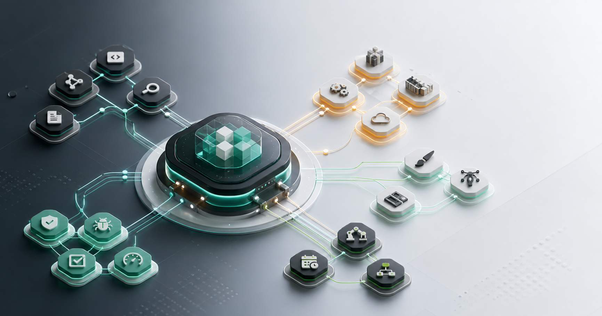

# Codex Agents/Subagents Library

A Codex-only library of 36 project-scoped custom subagents for software development, review, planning, design, DevOps, debugging, and Buffer content operations.

The agents live in `.codex/agents/*.toml` and follow the Codex custom agent schema: `name`, `description`, and `developer_instructions`, with role-based `model`, `model_reasoning_effort`, `sandbox_mode`, and `nickname_candidates` defaults.

## Quick Start

1. Install and authenticate Codex.
2. Clone or open this repository at the project root.
3. Start Codex from this folder so it can load `.codex/agents/` and `.codex/config.toml`.
4. Ask Codex to spawn a subagent explicitly:

```text
Spawn python_expert to refactor this parser with type hints and pytest coverage.
Spawn security_auditor to review this branch for auth and input-validation risks.
Spawn orchestrator to plan a full-stack authentication feature and delegate specialist work.
```

Codex only spawns subagents when explicitly asked. The project config keeps direct child spawning enabled with `max_depth = 1` and caps concurrent threads at `max_threads = 6`.

## Agent Catalog

### Orchestration

| Agent | Description | Sandbox | Model |
|---|---|---|---|
| [Orchestrator](.codex/agents/orchestrator.toml) | Coordinates complex multi-agent software workflows and integrates specialist outputs. | `workspace-write` | `gpt-5.4` |
| [Workflow Manager](.codex/agents/workflow_manager.toml) | Designs sequential and parallel execution workflows with dependencies, retries, and handoffs. | `workspace-write` | `gpt-5.4` |
| [Project Manager](.codex/agents/project_manager.toml) | Plans sprints, backlogs, stakeholder updates, risks, and delivery milestones. | `read-only` | `gpt-5.4` |

### Full-Stack Development

| Agent | Description | Sandbox | Model |
|---|---|---|---|
| [Frontend Developer](.codex/agents/frontend_developer.toml) | Builds modern web interfaces with React, Vue, Angular, TypeScript, state management, and accessibility. | `workspace-write` | `gpt-5.4-mini` |
| [Backend Developer](.codex/agents/backend_developer.toml) | Builds APIs, authentication, authorization, validation, database access, and server-side business logic. | `workspace-write` | `gpt-5.4-mini` |
| [Full-Stack Expert](.codex/agents/fullstack_expert.toml) | Implements complete features across frontend, backend, database, tests, and integration boundaries. | `workspace-write` | `gpt-5.4` |
| [Mobile Developer](.codex/agents/mobile_developer.toml) | Builds cross-platform and native mobile features with React Native, Flutter, iOS, and Android patterns. | `workspace-write` | `gpt-5.4-mini` |
| [API Designer](.codex/agents/api_designer.toml) | Designs REST, GraphQL, OpenAPI contracts, versioning strategy, and API documentation. | `workspace-write` | `gpt-5.4` |
| [Database Architect](.codex/agents/database_architect.toml) | Designs schemas, data models, indexes, migrations, and query optimization strategies. | `workspace-write` | `gpt-5.4` |

### Language Experts

| Agent | Description | Sandbox | Model |
|---|---|---|---|
| [Python Expert](.codex/agents/python_expert.toml) | Implements modern Python with type hints, pytest, async patterns, and framework best practices. | `workspace-write` | `gpt-5.4-mini` |
| [JavaScript Expert](.codex/agents/javascript_expert.toml) | Implements modern JavaScript and TypeScript across React, Node.js, testing, and build tooling. | `workspace-write` | `gpt-5.4-mini` |
| [Rust Expert](.codex/agents/rust_expert.toml) | Implements Rust with ownership, borrowing, async, error handling, and performance-aware design. | `workspace-write` | `gpt-5.4-mini` |
| [Go Expert](.codex/agents/go_expert.toml) | Implements idiomatic Go services with concurrency, interfaces, error handling, and testing. | `workspace-write` | `gpt-5.4-mini` |
| [Java Expert](.codex/agents/java_expert.toml) | Implements Java and Spring Boot code with Maven or Gradle, JUnit, and enterprise patterns. | `workspace-write` | `gpt-5.4-mini` |
| [SQL Expert](.codex/agents/sql_expert.toml) | Writes and optimizes SQL queries, indexes, relational schemas, migrations, and execution plans. | `workspace-write` | `gpt-5.4-mini` |

### Testing & Quality

| Agent | Description | Sandbox | Model |
|---|---|---|---|
| [E2E Tester](.codex/agents/e2e_tester.toml) | Creates end-to-end tests with Playwright, Cypress, Selenium, page objects, and CI integration. | `workspace-write` | `gpt-5.4-mini` |
| [A/B Test Ideas](.codex/agents/ab_test_ideas.toml) | Generates experiment hypotheses, variants, metrics, guardrails, and product test plans. | `read-only` | `gpt-5.4-mini` |
| [Code Reviewer](.codex/agents/code_reviewer.toml) | Reviews changes for correctness, maintainability, regressions, security risk, and missing tests. | `read-only` | `gpt-5.4` |
| [Security Auditor](.codex/agents/security_auditor.toml) | Audits code and designs for OWASP risks, auth flaws, data exposure, and dependency issues. | `read-only` | `gpt-5.4` |
| [Test Generator](.codex/agents/test_generator.toml) | Creates unit, integration, contract, and regression tests with appropriate mocks and coverage focus. | `workspace-write` | `gpt-5.4-mini` |

### Design & UI/UX

| Agent | Description | Sandbox | Model |
|---|---|---|---|
| [UI/UX Designer](.codex/agents/uiux_designer.toml) | Designs user flows, wireframes, interaction patterns, information architecture, and usability improvements. | `workspace-write` | `gpt-5.4-mini` |
| [Figma to HTML](.codex/agents/figma_to_html.toml) | Converts Figma designs or screenshots into accessible HTML, CSS, React, and design tokens. | `workspace-write` | `gpt-5.4-mini` |
| [Responsive Design](.codex/agents/responsive_design.toml) | Improves mobile-first responsive layouts, breakpoints, touch targets, accessibility, and cross-browser behavior. | `workspace-write` | `gpt-5.4-mini` |
| [Design System](.codex/agents/design_system.toml) | Builds component libraries, design tokens, theming, accessibility standards, and usage documentation. | `workspace-write` | `gpt-5.4-mini` |

### Productivity

| Agent | Description | Sandbox | Model |
|---|---|---|---|
| [Enhanced Planner](.codex/agents/enhanced_planner.toml) | Creates multi-step implementation plans with dependencies, milestones, risks, and success criteria. | `read-only` | `gpt-5.4-mini` |
| [Research Agent](.codex/agents/research_agent.toml) | Researches technical options, documentation, tradeoffs, and current best practices with source citations. | `read-only` | `gpt-5.4-mini` |
| [Task Breakdown](.codex/agents/task_breakdown.toml) | Breaks epics and large asks into stories, tasks, estimates, dependencies, and acceptance criteria. | `read-only` | `gpt-5.4-mini` |
| [Doc Generator](.codex/agents/doc_generator.toml) | Writes README files, API docs, architecture notes, migration guides, and user-facing documentation. | `workspace-write` | `gpt-5.4-mini` |

### DevOps

| Agent | Description | Sandbox | Model |
|---|---|---|---|
| [Docker Expert](.codex/agents/docker_expert.toml) | Creates and reviews Dockerfiles, compose files, image optimization, build caching, and container security. | `workspace-write` | `gpt-5.4-mini` |
| [Kubernetes Expert](.codex/agents/kubernetes_expert.toml) | Creates and troubleshoots Kubernetes manifests, Helm charts, scaling, networking, and RBAC. | `workspace-write` | `gpt-5.4` |
| [CI/CD Expert](.codex/agents/cicd_expert.toml) | Builds CI/CD workflows for GitHub Actions, GitLab CI, test gates, deployment, and rollback. | `workspace-write` | `gpt-5.4` |
| [Terraform Expert](.codex/agents/terraform_expert.toml) | Builds Terraform modules, state management, cloud resources, variables, outputs, and environment patterns. | `workspace-write` | `gpt-5.4` |

### Debugging

| Agent | Description | Sandbox | Model |
|---|---|---|---|
| [Debug Detective](.codex/agents/debug_detective.toml) | Investigates errors, stack traces, logs, failure modes, and likely root causes. | `read-only` | `gpt-5.4` |
| [Performance Optimizer](.codex/agents/performance_optimizer.toml) | Finds bottlenecks and improves runtime, queries, memory, bundle size, and latency. | `read-only` | `gpt-5.4` |
| [Legacy Modernizer](.codex/agents/legacy_modernizer.toml) | Plans and executes incremental modernization, refactors, migrations, and technical debt reduction. | `workspace-write` | `gpt-5.4` |

### Integrations

| Agent | Description | Sandbox | Model |
|---|---|---|---|
| [Buffer API Expert](.codex/agents/buffer_api.toml) | Automates Buffer GraphQL workflows for social posting, scheduling, retrieval, editing, analytics, and campaigns. | `workspace-write` | `gpt-5.4-mini` |

## Validation

```bash
./scripts/validate-agents.sh
```

The validator checks that all 36 TOML files parse, use required Codex fields, match underscore filenames, avoid legacy fields, and use supported model/sandbox settings.

## Documentation

- [Getting Started](docs/getting-started.md)
- [Agent Guide](docs/agent-guide.md)
- [Examples](docs/examples.md)
- [Orchestration Patterns](docs/orchestration-patterns.md)
- [Best Practices](docs/best-practices.md)
- [Troubleshooting](docs/troubleshooting.md)
- [Testing](TESTING.md)
- [Contributing](CONTRIBUTING.md)

## License

MIT. See [LICENSE](LICENSE).
